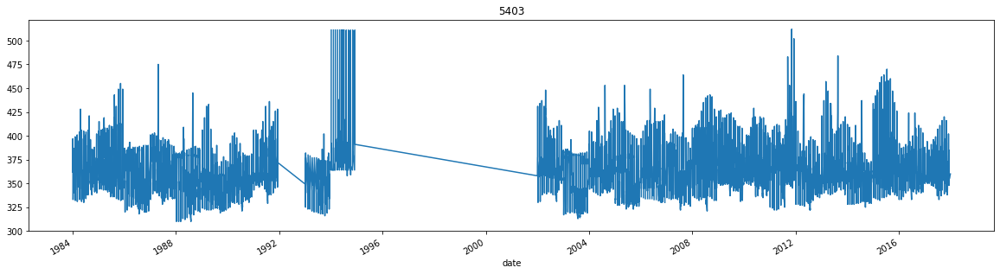

### Предсказание уровня воды реки Амур 
Прооект выполнен в рамках соревнования AIJ NoFloodWithAI 

Задача соревновая состояла в создании модели прогнозирования уровня воды на нескольких гидропостах на реке Амур.
Прогнозирование краткосрочное - 10 дней.

#### Состав датасета:
- исторические данные по уровням воды на 189 гидропостах, 7 из которых целевые (01.01.1984 - 01.10.2020);
- исторические данные по расходу воды, ее температуре, толщине льда, высоте снежного покрова 
  и состоянию водной поверхности с нескольких гидропостов (1984 - 2018);
- данные метеорологических наблюдение с 109 станций Росгидромета (1985 - 2018);
- данные по координатам гидропостов и метеостанций;
- **+можно** добывать дополнительные данные из сторонних источников и конструировать свои переменные.

Карта с нанесенными на нее наблюдательными пунктами:

 

Легенда:   
Большие геотеги - целелевые гидропосты   
Малые синие круги - остальные гидропосты  
Красные точки - метеостанции

#### Ход подготовки исходных данных:
1) Данные в исходном виде имели непригодную для чтения разметку и нестандартное форматирование, поэтому были  
   заново переразмечены и сохранены в привычный csv формат;
2) Данные по уровням воды оказались рваными посередине и по краям, поэтому пропуски заполнялись либо переходящими значениями, 
   если пропуск был между двумя соседними значениями, либо первыми или последним значениями, если пропуски находились в начале и
   конце рядов, соответственно.
   

 
   
   Если данных в ряду оказывалось менее половины, то все данные по этому гидропосту исключались из финального дасасета;
   

   
3) Была проведена привязка метеостанций к гидропостам неконтролирукемым методом поиска ближайших соседей `NearestNeighbors`. 
   На каждый гидропост были привязаны по 2 метелстанции.
   Данные по метеостанциям были усреднены.
   Значения направления ветра так же были усреднены с учетом скорости (средний вектор) и затем категоризованы  
   (направление из градусов -> SSW, W, NE и т.д.);
4) Выполнено сведение данных в финальный датасет, где все данные приведены для каждого гидропоста (кроме исключенных); 

#### Конструирование новых пременных
На основе данных уровня воды (целевой переменной) были образованы следующие переменные:
- Среднее, стандартное отклонение и медиана целевой переменной за месяц;
- Среднее целевой переменной за месяц со сдвигами в 1 месяц и 1 год;
- Скользящее среднее целевой переменной за 7, 10, 15, 30 дней с лагом в 1 день;
- Скользящяя медиана целевой переменной за 7, 10, 15, 30 дней с лагом в 1 день;
- Скользящее среднее целевой переменной за 7, 10, 15, 30 дней с лагом в 30 дней;
- Скользящее среднее целевой переменной за 7, 10, 15, 30 дней с лагом в 365 дней;
- Скользящее стандартное отклонение целевой переменной за 7, 10, 15, 30 дней с лагом в 30 дней;
- Скользящее стандартное отклонение целевой переменной за 7, 10, 15, 365 дней с лагом в 365 дней;
- Скользящая медиана целевой переменной за 7, 10, 15, 30 дней с лагом в 30 дней;
- Скользящая медиана целевой переменной за 7, 10, 15, 365 дней с лагом в 365 дней;
- Первые разности целевой переменной.

#### Добыча данных из сторонних источников
Для усиления датасета были притянуты данные о высоте гидропостов над уровнем моря.
Эти данные были выбраны из-за того, что уровень воды находится в сильной зависимости от высоты гидропоста,
а точнее от разницы высот между соседними гидропостами. 

#### Выбор модели
В качестве модели был выбран `CatBoostRegressor`.
Метрикой качества при обучении была выбрана MAPE.
Кросс-валидация проводилась методом скользящего окна
Модель предсказывает изменение уровня воды относительно предыдущего дня, затем пересчитывается в абсолютное значение

